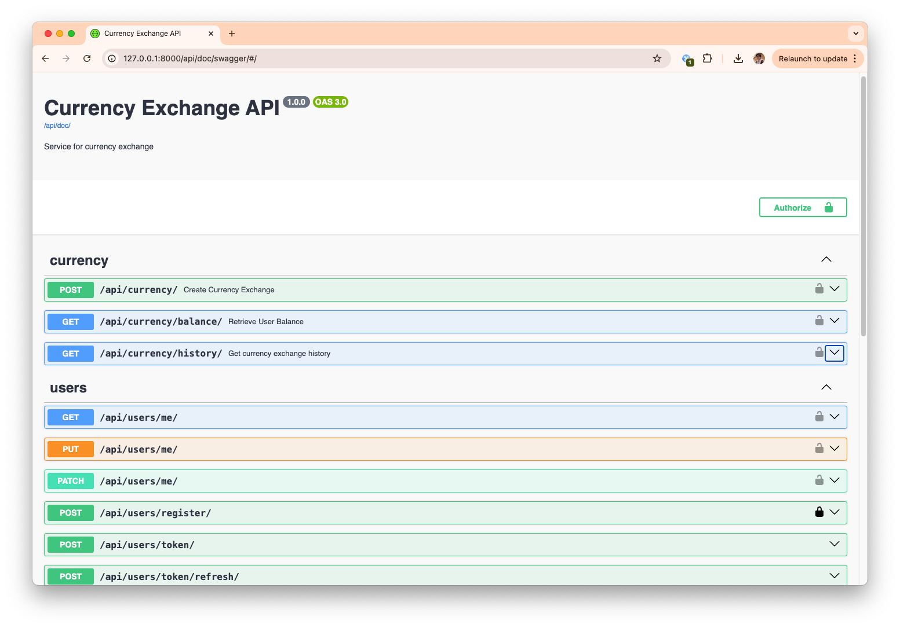

# Currency Exchange API

A REST API for secure currency exchange operations with user balance tracking.

## Features

- 💰 User balance management
- 🔄 Currency exchange (1 coin fee per transaction)
- 📊 Transaction history
- 🔐 JWT authentication
- ⚡ Two setup modes: Dev (Locally/SQLite) & Prod (Docker/PostgreSQL)

## Setup Options

### Option 1: Development (SQLite)
```bash
# Clone and enter project
git clone https://github.com/Den-k0/currency-exchange-api
cd currency-exchange-api

# Create virtual environment
python -m venv venv
source venv/bin/activate  # Windows: venv\Scripts\activate

# Install dependencies
pip install poetry
poetry install

# Configure environment
cp .env.example .env
# Edit .env (set your EXCHANGE_RATE_API_KEY)

# Run migrations
python manage.py migrate

# Create superuser (optional)
python manage.py createsuperuser

# Start dev server
python manage.py runserver
```

### Option 2: Production (Docker)
```bash
# Clone and enter project
git clone https://github.com/Den-k0/currency-exchange-api
cd currency-exchange-api

# Configure environment
cp .env.example .env
# Edit .env (set your EXCHANGE_RATE_API_KEY)

# Uncoment the following line in .env
DJANGO_SETTINGS_MODULE=core.settings.prod

# Build and run Docker containers (docker must be installed and running)
docker-compose up --build
```

## API Documentation

To access the API documentation, navigate to:
```bash
# Swagger
http://localhost:8000/api/swagger

# ReDoc
http://localhost:8000/api/redoc

# or download the OpenAPI spec
http://localhost:8000/api/doc
```


